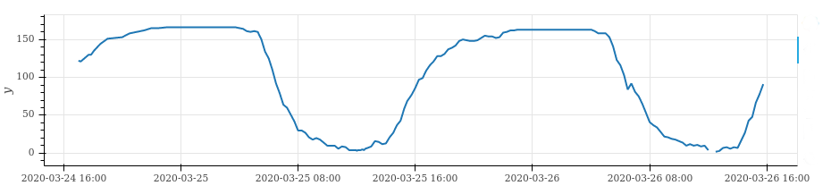

## scraper for free parking places

to build an historical archive!



The archived numbers can be found in the [parking-data](https://github.com/defgsus/parking-data) repository.

This is just a simple scraper. It takes web-sites or api endpoints and collects json-compatible data
which is then stored to json files with the filename being the timestamp. 

There is a [small article](https://defgsus.github.io/blog/2021/04/08/one-year-parking.html)
written after one year of scraping.


## Run

```shell script
python main.py store
```

to store a snapshot of each data source in the `./snapshot/` directory.

Any error will be written to the `./errors/` directory.


## Add new websites 
to `./sources/` and test/develop via

```shell script
python main.py dump -i my-new-source --cache
```

Run the `store` script regularly on a server and call

```shell script
rsync -avz -L -e 'ssh -p PORT' USER@SERVER:/PATH/parking-scraper/snapshots .
```
to update your local `snapshots` directory.

For disk-space reasons, a `DataSource` instance should store minimal necessary info and throw any meta-info away. 
For example, it should not store a complete geojson file, just the names, statuses and free spaces 
of each parking lot. Storage of meta data can be implemented separately.

Each `DataSource` can implement a `transform_snapshot_data` function that transforms a snapshot into *cononical* 
data that has the same format for each parking place and can be exported via `python main.py load` 

## Access data

through `util.Storage` and `util.DataSources` (see `./notebooks/`). or via

```shell script
python main.py load
```

### To run as cron-job

type `crontab -e` and add something like

```crontab
*/15 * * * * /bin/sh -c 'cd /path/to/parking-scraper && ./env/bin/python main.py store'
```
